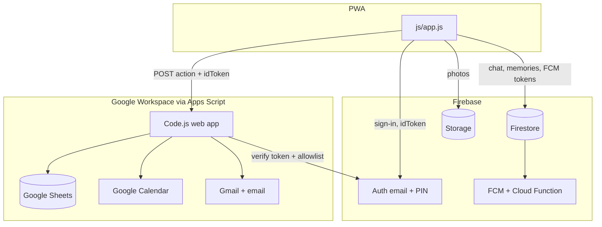

# Architecture — Sheets vs Firebase

Wong Family Log uses **two backends on purpose**. Each owns a different kind of data. Do not dual-write the same feature to both.



---

## Rule of thumb

| Put it in **Firebase** when… | Put it in **Sheets + GAS** when… |
|------------------------------|----------------------------------|
| Needs **live multi-user** updates (chat, photo album) | Is a **ledger / log / list** parents may open in a spreadsheet |
| Is a **binary file** (images) | Needs **Gmail**, **Calendar**, or **email** (bank scan, digests, approval links) |
| Is **device/session** state (FCM tokens) | Needs **server-side adult gates** without trusting the client UI alone |
| Auth identity | Batch jobs and time-driven triggers in Apps Script |

**Identity bridge:** Firebase Auth is the only login. GAS never trusts `user` from the client; it verifies `idToken` and maps email → member name.

---

## Ownership map (source of truth)

### Firebase (sole owner)

| Data | Where | Why |
|------|--------|-----|
| Login | Auth | Family accounts, PIN passwords |
| Chat messages | Firestore `chat/` | Realtime, multi-device |
| Chat / memory images | Storage `chat/{email}/`, `memories/{email}/` | Large blobs; not Sheets |
| Memories metadata | Firestore `memories/` | Realtime album; images already in Storage |
| FCM tokens | Firestore `users/{email}` | Push targeting |
| Chat push | Cloud Function `index.js` | Triggered by new chat docs |

**Client:** write/read via Firebase SDK + security rules.  
**GAS:** must **not** create chat or memories. Reject `add_chat_message` / `add_memory`. `get_all` must **not** return chat or memories.

### Google Sheets + Apps Script (sole owner)

| Sheet / system | Feature | Why Sheets/GAS |
|----------------|---------|----------------|
| Expenses, Budgets, RecurringExpenses | Money ledger | Spreadsheet audit, formulas, bank-email import |
| ToDo | Tasks | Simple rows + morning digest |
| Birthdays | Dates | Digest + calendar-style lists |
| Travel | Trip log | Lat/lng list for map |
| Fertility, Appreciations, LoveCheckins, IntimacyLog, BucketList | Us / parents | Private logs; adult allowlist in GAS |
| Calendar (sheet mirror) + **Google Calendar API** | Events / schedules | Real calendar + family calendar ID |
| Log | Write audit | Debug trail |
| Gmail | PayLah / bank scan | Only Apps Script can read mailbox |
| MailApp | Digests, expense approval | Workspace email |

**Client:** `gasRequest` / `gPost` with Firebase `idToken`.  
**Never** put chat/memories here.

### Explicitly not dual-homed

| Feature | Was | Now |
|---------|-----|-----|
| Chat | Historically Sheets | **Firestore only** |
| Memories | Sheets + Drive, then dual Firestore | **Firestore + Storage only** |
| Expenses / Us / fertility | Sheets | **Sheets only** (no Firestore collection) |

---

## Request paths

```
loadData()     → POST { action: "get_all", idToken }  → GAS → Sheets (+ Calendar)
gPost(note)    → POST { action: "write", note, idToken, … } → GAS → Sheets / Calendar
sendChat…      → Firestore + Storage only
submitMemory   → Storage (optional image) + Firestore only
```

`applyDashboardPayload` **must preserve** `data.chat` and `data.memories` from Firestore listeners and ignore any legacy GAS fields for those keys.

---

## Security layers

1. **Firebase Auth** — who is signed in.  
2. **Firestore / Storage rules** — family email allowlist; memories/chat sender checks.  
3. **GAS** — verify ID token + `ALLOWED_EMAILS` + `ADULT_EMAILS` for Us/fertility/intimacy.  
4. **Spreadsheet ACL** — who can open the sheet in Google Drive (especially IntimacyLog / Fertility).

Adult UI hiding is **not** security; GAS empty payloads + write deny are.

---

## When to move something

| Move **to Firebase** if… | Keep on **Sheets** if… |
|--------------------------|-------------------------|
| Users complain about stale multi-device UI | You open it in Sheets weekly |
| Needs offline-first document sync | Depends on Gmail/Calendar triggers |
| Heavy realtime collaboration | Batch nightly jobs are enough |

**Do not** migrate expenses/budgets to Firestore without a plan for bank-email import and spreadsheet review. **Do not** put intimacy/fertility only in Firestore without hardening rules (adult-only collections) and accepting loss of easy sheet export.

---

## Optional: old Sheets `Memories` tab

Historical rows may still exist in the spreadsheet. The app no longer reads or writes them. To migrate once:

1. Export the `Memories` sheet.  
2. For each row, create a Firestore `memories` doc (and re-upload images to Storage if URLs are Drive-only).  
3. Archive or hide the sheet tab.

---

## File map

| File | Backend role |
|------|----------------|
| `js/app.js` | UI; Firebase SDK for chat/memories/auth; GAS client for everything else |
| `Code.js` | Sheets + Calendar + Gmail; token verify; **no** chat/memories persistence |
| `firestore.rules` / `storage.rules` | Firebase access control |
| `index.js` | Chat → FCM |
| `firebase-messaging-sw.js` | PWA cache + background push |
