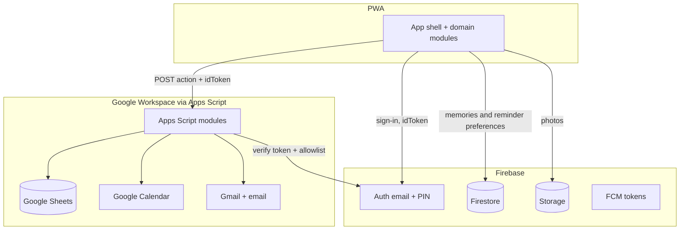

# Architecture — Sheets vs Firebase

Wong’s Nest uses **two backends on purpose**. Each owns a different kind of data. Do not dual-write the same feature to both.


```mermaid
flowchart TB
  subgraph client [PWA]
    UI[App shell + domain modules]
  end

  subgraph firebase [Firebase]
    Auth[Auth email + PIN]
    FS[(Firestore)]
    ST[(Storage)]
    FCM[FCM tokens]
  end

  subgraph google [Google Workspace via Apps Script]
    GAS[Apps Script modules]
    SH[(Google Sheets)]
    CAL[Google Calendar]
    MAIL[Gmail + email]
  end

  UI -->|sign-in, idToken| Auth
  UI -->|memories and reminder preferences| FS
  UI -->|photos| ST
  UI -->|POST action + idToken| GAS
  GAS -->|verify token + allowlist| Auth
  GAS --> SH
  GAS --> CAL
  GAS --> MAIL
```

---

## Rule of thumb

| Put it in **Firebase** when… | Put it in **Sheets + GAS** when… |
|------------------------------|----------------------------------|
| Needs **live multi-user** updates (photo album) | Is a **ledger / log / list** parents may open in a spreadsheet |
| Is a **binary file** (images) | Needs **Gmail**, **Calendar**, or **email** (bank scan, digests, approval links) |
| Is **device/session** state (FCM tokens) | Needs **server-side adult gates** without trusting the client UI alone |
| Auth identity | Batch jobs and time-driven triggers in Apps Script |

**Identity bridge:** Firebase Auth is the only login. GAS never trusts `user` from the client; it verifies `idToken` and maps email → member name.

---

## Ownership map (source of truth)

### Firebase (sole owner)

| Data | Where | Why |
|------|--------|-----|
| Login | Auth | Family accounts, PIN passwords |
| Memories metadata | Firestore `memories/` | Realtime album; images already in Storage |
| Memory images | Storage `memories/{email}/` | Large blobs; not Sheets |
| Reminder settings / device tokens | Firestore `users/{email}` / `notificationDevices/{hashedDeviceId}` | Account preferences / current device targeting |

**Client:** write/read via Firebase SDK + security rules.  
**GAS:** must **not** create memories. Reject `add_chat_message` / `add_memory`. `get_all` must **not** return chat or memories. Chat has been removed from the app.

### Google Sheets + Apps Script (sole owner)

| Sheet / system | Feature | Why Sheets/GAS |
|----------------|---------|----------------|
| Expenses, Budgets, RecurringExpenses | Money ledger | Spreadsheet audit, formulas, bank-email import |
| ToDo | Tasks | Simple rows + morning digest; Reward Member preserves the first completion recipient |
| Habits, HabitLogs | Daily practice | Server-derived member and one log per habit/member/day |
| RewardRules, RewardLedger, Companions | Companions and stars | Parent-selected rules, immutable earning/purchase IDs, authenticated member profiles |
| Birthdays | Dates | Digest + calendar-style lists |
| Travel | Trip log | Lat/lng list for map |
| Fertility, Appreciations, LoveCheckins, IntimacyLog, BucketList | Us / parents | Private logs; adult allowlist in GAS |
| Calendar (sheet mirror) + **Google Calendar API** | Events / schedules | Real calendar + family calendar ID |
| Log | Write audit | Debug trail |
| Gmail | PayLah / bank scan | Only Apps Script can read mailbox |
| MailApp | Digests, expense approval | Workspace email |

**Client:** `gasRequest` / `gPost` with Firebase `idToken`.  
**Never** put chat/memories here.

### Explicitly not dual-homed

| Feature | Was | Now |
|---------|-----|-----|
| Chat | Historically Sheets, then Firestore | **Removed from the app** |
| Memories | Sheets + Drive, then dual Firestore | **Firestore + Storage only** |
| Expenses / Us / fertility | Sheets | **Sheets only** (no Firestore collection) |

---

## Request paths

```
loadData()     → POST { action: "get_all", idToken }  → GAS → Sheets (+ Calendar)
gPost(note)    → POST { action: "write", note, idToken, … } → GAS → Sheets / Calendar
submitMemory   → Storage (optional image) + Firestore only
```

`applyDashboardPayload` **must preserve** `data.memories` from Firestore listeners and ignore any legacy GAS fields for those keys.

---

## Security layers

1. **Firebase Auth** — who is signed in.  
2. **Firestore / Storage rules** — family email allowlist; memory owner checks; Chat paths denied.
3. **GAS** — verify ID token + `ALLOWED_EMAILS` + `ADULT_EMAILS` for Us/fertility/intimacy.  
4. **Spreadsheet ACL** — who can open the sheet in Google Drive (especially IntimacyLog / Fertility).

Adult UI hiding is **not** security; GAS empty payloads + write deny are.

---

## When to move something

| Move **to Firebase** if… | Keep on **Sheets** if… |
|--------------------------|-------------------------|
| Users complain about stale multi-device UI | You open it in Sheets weekly |
| Needs offline-first document sync | Depends on Gmail/Calendar triggers |
| Heavy realtime collaboration | Batch nightly jobs are enough |

**Do not** migrate expenses/budgets to Firestore without a plan for bank-email import and spreadsheet review. **Do not** put intimacy/fertility only in Firestore without hardening rules (adult-only collections) and accepting loss of easy sheet export.

---

## Optional: old Sheets `Memories` tab

Historical rows may still exist in the spreadsheet. The app no longer reads or writes them. To migrate once:

1. Export the `Memories` sheet.  
2. For each row, create a Firestore `memories` doc (and re-upload images to Storage if URLs are Drive-only).  
3. Archive or hide the sheet tab.

---

## File map

| File | Backend role |
|------|----------------|
| `js/app.js` | App initialization, navigation and remaining forms; shared globals retained during incremental extraction |
| `js/session.js`, `js/api.js`, `js/status.js` | Account reset, authenticated transport, bounded requests and connection/refresh status |
| `js/calendar.js`, `js/money.js`, `js/memories.js` | Calendar views, money views, Firestore/photo recovery and memory archive |
| `js/modals.js` | Generic dialog focus trapping, Escape, backdrop dismissal and focus restoration |
| `Code.js`, `gas/auth.js`, `gas/calendar.js`, `gas/tasks.js`, `gas/money.js`, `gas/rewards.js` | Apps Script API, Sheets/Calendar/Gmail handlers and extracted money/reward helpers; no Firebase-owned persistence |
| `firestore.rules` / `storage.rules` | Firebase access control |
| `index.js`, `reminder-functions.js`, `reminder-plan.js` | AI extraction, validated reminder settings, scheduled FCM reminders and upload cleanup |
| `firebase-messaging-sw.js` | PWA cache + background push |
| `BRAND.md` | Wong’s Nest brand and design system |
| `css/styles.css` | Design tokens, typography, dark mode, responsive layout |
| `assets/nest-mark.svg`, `assets/nest-icon.svg` | Nest emblem and app icon masters |
| `css/nest.css`, `js/nest.js` | Current visual tokens, responsive shell, icons and page headings |

---

## Brand & Design System Governance

All UI development follows [BRAND.md](BRAND.md), Wong’s Nest version 2.0. The responsive shell and navigation are in `js/nest.js`; theme and component styling are in `css/nest.css`, loaded after the original base components. The nest emblem replaces the previous H-shaped mark.

Use semantic colour tokens, Nunito headings, DM Sans body text, and accessible SVG navigation. Desktop groups destinations into family activities, memories and parent tools. Mobile provides Home, Plan, Tasks, Nest and More. Existing adult gates and server checks remain authoritative. Rebranding does not change Firebase project IDs, Apps Script URLs, storage paths, or saved preference keys.


## Reward consistency

Rewards are owned by Apps Script and Sheets, under the same script lock as task and habit writes. Save the completion before awarding stars. Deterministic earning IDs allow retries to recover missing awards without duplicating them; an Everyone task stores the first recipient alongside completion in ToDo column M. Habit rewards key on the definition ID, actual member and Singapore date, surviving log deletion.

Purchases use the fixed server catalog, verified caller identity and current ledger balance. A deterministic member/item ID makes retrying a purchase harmless. Profiles can only equip owned accessories. Only parents can choose reward rules; client-supplied member, price or star values never control an award or purchase. Balances include spending; the cooperative garden uses lifetime earned stars. No rewards are stored in Firebase or granted offline.


## Session isolation and save feedback

Every account change clears client data, parent-only rendered content, forms, cached tokens, Firebase listeners and uncommitted Undo actions. GAS responses are accepted only by the originating session. Dashboard request generations prevent older reads from replacing newer refreshes or completed writes. Accepted dashboards replace private lists; child accounts always clear parent-only fields. School uploads, extraction and original-image requests also reject results from closed or reset reviews.

Forms clear and report success only after a confirmed backend save. Refresh returns a success flag. Calendar deletion follows the five-second deferred Undo mechanism: Undo cancels the write, expiry commits it, and a failed foreground commit restores the local item with a warning. Leaving the page uses the existing authenticated beacon path; the next dashboard refresh reconciles its outcome. Signing out during the Undo window cancels the uncommitted deletion.


## Scheduled habits and daily checklist

Habits columns G–K store Schedule, Weekdays, WeeklyTarget, State and UpdatedAt. Blank legacy values mean daily/active. Habit IDs and logs survive edits, pausing and archiving; the legacy delete endpoint now archives. Shared completions use the verified child identity or a parent-validated `log_member`. Server schedule checks control reward eligibility; weeks run Monday–Sunday in Singapore, counting distinct completion dates. The client helpers are in `js/habits.js`.

Dashboard `completedTasks` retains ordinary completed tasks for the child’s day view and uses the same verified-member filter as open tasks. The family milestone selection is owned by the `FamilyGoal` Sheet; its fixed server catalog does not alter the earning ledger or balances.

## Reminders and recovery

`updateReminderSettings` validates family identity, account preferences and device bindings. One installation/token binds to one active account. A parent-authenticated opt-in provisions a matching secret in GAS Script Properties; scheduled snapshot requests use timestamped HMAC signatures. `sendFamilyReminders` checks Singapore time and quiet hours every 15 minutes, filters assignments and habit schedules, then claims one account/day delivery receipt transactionally. FCM uses data-only payloads; the service worker checks its persistent active account, serializes delivery, suppresses repeated IDs and checks the account again on notification click. `users` preferences and device/receipt collections are server-written; retired Chat paths are denied.

`js/operations.js` retains only a payload digest and UUID until confirmation. GAS scopes the key to verified email/action, validates its fingerprint under the script lock, and recovers from resource or operation-ledger response loss. Calendar uses a deterministic native event ID and recovers HTTP 409 conflicts; other creates store their ID/fingerprint in appended columns. Legacy requests without operation IDs remain supported.

`js/memories.js` keeps the draft/upload on metadata failure and confirms uncertain writes by reading its stable document ID. Photo retries renew object metadata; cleanup uses object generation and metageneration preconditions after checking for a committed document. Latest memories stay live and older pages use Firestore cursors with deduplication. Draft state and listeners reset on account changes.

## Navigation, recovery and verification

Parents use Plan; children use Habits as their primary day-to-day destination. Child Home still combines their assigned/shared events, tasks and scheduled habits. Chat has no current UI or write pipeline; retired Chat documents and attachments are deleted, and access is denied.

Domain scripts load before the app initializer and continue sharing its existing globals. This is an incremental extraction, not a backend migration. Apps Script uploads `Code.js` plus `gas/*.js` together; the test harness loads the same sources. Calendar preparation reconciliation uses the script lock, updates future open tasks after rescheduling, retires cancelled preparation, and preserves completed history and manual deletions. Failed Calendar reads abort the dashboard instead of cancelling tasks. Money and coordinates reject non-finite/out-of-range input.

`js/api.js` rejects offline writes before transport; rewards are never queued. Token acquisition and fetch share an abort deadline (45 seconds for reads, 120 for writes). An offline/last-refreshed banner describes the accepted dashboard for the current session. A fresh session clears that timestamp. Generic modals have named dialog semantics, a Tab loop, Escape/backdrop dismissal through one path, and focus restoration. Selection chips use keyboard-operable buttons. Reduced-motion companion styling remains enabled.

CI runs Node regressions, Chromium failure flows and actual Firestore/Storage emulator rule tests on pushes and pull requests. Manual production deployment reruns those checks and deploys only from main through the production environment. Traces are retained on browser failures. See `docs/testing-and-deployment.md` for commands and environment/credential setup.
