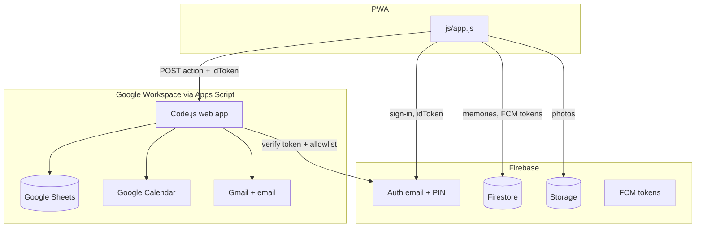

# Architecture — Sheets vs Firebase

Wong’s Nest uses **two backends on purpose**. Each owns a different kind of data. Do not dual-write the same feature to both.


```mermaid
flowchart TB
  subgraph client [PWA]
    UI[js/app.js]
  end

  subgraph firebase [Firebase]
    Auth[Auth email + PIN]
    FS[(Firestore)]
    ST[(Storage)]
    FCM[FCM tokens]
  end

  subgraph google [Google Workspace via Apps Script]
    GAS[Code.js web app]
    SH[(Google Sheets)]
    CAL[Google Calendar]
    MAIL[Gmail + email]
  end

  UI -->|sign-in, idToken| Auth
  UI -->|memories, FCM tokens| FS
  UI -->|photos| ST
  UI -->|POST action + idToken| GAS
  GAS -->|verify token + allowlist| Auth
  GAS --> SH
  GAS --> CAL
  GAS --> MAIL
```

---

## Rule of thumb

| Put it in **Firebase** when… | Put it in **Sheets + GAS** when… |
|------------------------------|----------------------------------|
| Needs **live multi-user** updates (photo album) | Is a **ledger / log / list** parents may open in a spreadsheet |
| Is a **binary file** (images) | Needs **Gmail**, **Calendar**, or **email** (bank scan, digests, approval links) |
| Is **device/session** state (FCM tokens) | Needs **server-side adult gates** without trusting the client UI alone |
| Auth identity | Batch jobs and time-driven triggers in Apps Script |

**Identity bridge:** Firebase Auth is the only login. GAS never trusts `user` from the client; it verifies `idToken` and maps email → member name.

---

## Ownership map (source of truth)

### Firebase (sole owner)

| Data | Where | Why |
|------|--------|-----|
| Login | Auth | Family accounts, PIN passwords |
| Memories metadata | Firestore `memories/` | Realtime album; images already in Storage |
| Memory images | Storage `memories/{email}/` | Large blobs; not Sheets |
| FCM tokens | Firestore `users/{email}` | Push targeting |

**Client:** write/read via Firebase SDK + security rules.  
**GAS:** must **not** create memories. Reject `add_chat_message` / `add_memory`. `get_all` must **not** return chat or memories. Chat has been removed from the app.

### Google Sheets + Apps Script (sole owner)

| Sheet / system | Feature | Why Sheets/GAS |
|----------------|---------|----------------|
| Expenses, Budgets, RecurringExpenses | Money ledger | Spreadsheet audit, formulas, bank-email import |
| ToDo | Tasks | Simple rows + morning digest; Reward Member preserves the first completion recipient |
| Habits, HabitLogs | Daily practice | Server-derived member and one log per habit/member/day |
| RewardRules, RewardLedger, Companions | Companions and stars | Parent-selected rules, immutable earning/purchase IDs, authenticated member profiles |
| Birthdays | Dates | Digest + calendar-style lists |
| Travel | Trip log | Lat/lng list for map |
| Fertility, Appreciations, LoveCheckins, IntimacyLog, BucketList | Us / parents | Private logs; adult allowlist in GAS |
| Calendar (sheet mirror) + **Google Calendar API** | Events / schedules | Real calendar + family calendar ID |
| Log | Write audit | Debug trail |
| Gmail | PayLah / bank scan | Only Apps Script can read mailbox |
| MailApp | Digests, expense approval | Workspace email |

**Client:** `gasRequest` / `gPost` with Firebase `idToken`.  
**Never** put chat/memories here.

### Explicitly not dual-homed

| Feature | Was | Now |
|---------|-----|-----|
| Chat | Historically Sheets, then Firestore | **Removed from the app** |
| Memories | Sheets + Drive, then dual Firestore | **Firestore + Storage only** |
| Expenses / Us / fertility | Sheets | **Sheets only** (no Firestore collection) |

---

## Request paths

```
loadData()     → POST { action: "get_all", idToken }  → GAS → Sheets (+ Calendar)
gPost(note)    → POST { action: "write", note, idToken, … } → GAS → Sheets / Calendar
submitMemory   → Storage (optional image) + Firestore only
```

`applyDashboardPayload` **must preserve** `data.chat` and `data.memories` from Firestore listeners and ignore any legacy GAS fields for those keys.

---

## Security layers

1. **Firebase Auth** — who is signed in.  
2. **Firestore / Storage rules** — family email allowlist; memories/chat sender checks.  
3. **GAS** — verify ID token + `ALLOWED_EMAILS` + `ADULT_EMAILS` for Us/fertility/intimacy.  
4. **Spreadsheet ACL** — who can open the sheet in Google Drive (especially IntimacyLog / Fertility).

Adult UI hiding is **not** security; GAS empty payloads + write deny are.

---

## When to move something

| Move **to Firebase** if… | Keep on **Sheets** if… |
|--------------------------|-------------------------|
| Users complain about stale multi-device UI | You open it in Sheets weekly |
| Needs offline-first document sync | Depends on Gmail/Calendar triggers |
| Heavy realtime collaboration | Batch nightly jobs are enough |

**Do not** migrate expenses/budgets to Firestore without a plan for bank-email import and spreadsheet review. **Do not** put intimacy/fertility only in Firestore without hardening rules (adult-only collections) and accepting loss of easy sheet export.

---

## Optional: old Sheets `Memories` tab

Historical rows may still exist in the spreadsheet. The app no longer reads or writes them. To migrate once:

1. Export the `Memories` sheet.  
2. For each row, create a Firestore `memories` doc (and re-upload images to Storage if URLs are Drive-only).  
3. Archive or hide the sheet tab.

---

## File map

| File | Backend role |
|------|----------------|
| `js/app.js` | UI; Firebase SDK for chat/memories/auth; GAS client for everything else |
| `Code.js` | Sheets + Calendar + Gmail; token verify; **no** chat/memories persistence |
| `firestore.rules` / `storage.rules` | Firebase access control |
| `index.js` | Chat → FCM |
| `firebase-messaging-sw.js` | PWA cache + background push |
| `BRAND.md` | Wong’s Nest brand and design system |
| `css/styles.css` | Design tokens, typography, dark mode, responsive layout |
| `assets/nest-mark.svg`, `assets/nest-icon.svg` | Nest emblem and app icon masters |
| `css/nest.css`, `js/nest.js` | Current visual tokens, responsive shell, icons and page headings |

---

## Brand & Design System Governance

All UI development follows [BRAND.md](BRAND.md), Wong’s Nest version 2.0. The responsive shell and navigation are in `js/nest.js`; theme and component styling are in `css/nest.css`, loaded after the original base components. The nest emblem replaces the previous H-shaped mark.

Use semantic colour tokens, Nunito headings, DM Sans body text, and accessible SVG navigation. Desktop groups destinations into family activities, memories and parent tools. Mobile provides Home, Plan, Tasks, Nest and More. Existing adult gates and server checks remain authoritative. Rebranding does not change Firebase project IDs, Apps Script URLs, storage paths, or saved preference keys.


## Reward consistency

Rewards are owned by Apps Script and Sheets, under the same script lock as task and habit writes. Save the completion before awarding stars. Deterministic earning IDs allow retries to recover missing awards without duplicating them; an Everyone task stores the first recipient alongside completion in ToDo column M. Habit rewards key on the definition ID, actual member and Singapore date, surviving log deletion.

Purchases use the fixed server catalog, verified caller identity and current ledger balance. A deterministic member/item ID makes retrying a purchase harmless. Profiles can only equip owned accessories. Only parents can choose reward rules; client-supplied member, price or star values never control an award or purchase. Balances include spending; the cooperative garden uses lifetime earned stars. No rewards are stored in Firebase or granted offline.
