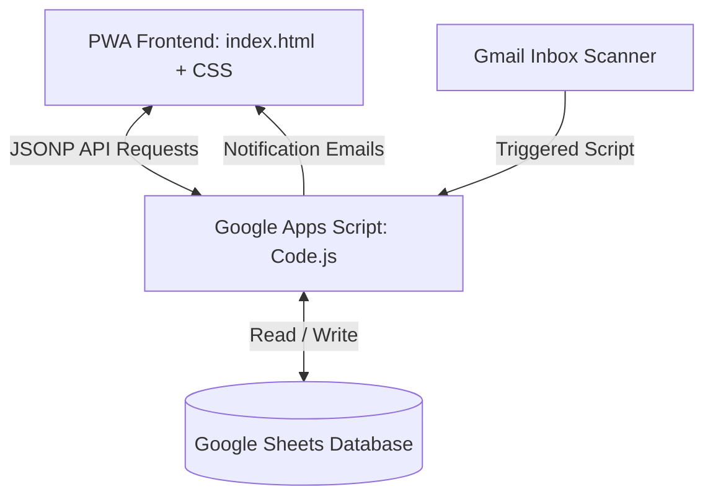

# 🏡 Wong Family Log

A premium, private, and automated Family Hub and Intimacy Sanctuary built as a serverless Progressive Web App (PWA). It integrates financial budgeting, bank alert expense auto-tracking, historical family travel mapping, and a private relationship connection space for the couple.

---

## 🌟 Key Features

### 1. 📊 Smart Financial Dashboard & Budgets
*   **Monthly Budget Trackers:** Visual HSL-tailored gauge bars tracking spending limits across categories (Household, Eating Out, Transport, Children, Self Care, Finance, etc.).
*   **Transaction Register:** Interactive ledger showing past expenses with date, category, account, and merchant tags.
*   **Quick Logging:** Client-side manual logger with merchant autocompletion based on past spending habits.

### 2. 🤖 Automated Bank Alert Scanner (Gmail Integration)
*   **Zero-Manual-Input Logging:** Scans your Gmail inbox for bank notification emails and logs them instantly as pending expenses.
*   **Supported Alert Formats:**
    *   **DBS PayLah!** Notifications (`paylah.alert@dbs.com`)
    *   **DBS iBanking PayNow & Card Alerts** (`ibanking.alert@dbs.com`)
    *   **Trust Bank Transactions** (`from_us@trustbank.sg`)
    *   **Shopee Checkout Receipts** (`info@mail.shopee.sg`)
*   **Smart Categorization & Duplicates:** Automatically categorizes merchants based on past patterns and filters duplicate transactions.
*   **One-Click Verification Email:** Sends an email digest containing a secure verification link to instantly confirm and write pending items into the main ledger.

### 3. 🗺️ Interactive Travel Map
*   **Leaflet-Powered Map:** Pinpoints all historical family trip locations.
*   **Interactive Markers:** Tapping locations reveals trip dates, visiting members (Marcus, Eleanor, Mikaela, Meaghan), and custom notes.
*   **Dynamic Filtering:** Filter trip markers by city, visiting member, or calendar year.

### 4. 💖 "Us" Connection Sanctuary
*   **Intimacy Portal:** A private, rose gold and glassmorphic dashboard designed specifically for the couple.
*   **Appreciation Jar:** Write sweet notes for your partner. Notes stay locked inside the jar, showing a locked note count, and automatically reveal themselves every Friday at 6:00 PM to build anticipation for date night.
*   **Weekly Battery Check-in:** A weekly check-in form featuring a 1-5 heart selector, mood tags, and next week's focus areas. 
*   **Historical Timeline:** A collapsible historical check-in tracker showing past battery logs and relationship goals.
*   **Spark Roulette:** A card-flip connection starter widget packed with 30+ deep conversation prompts and 20+ date ideas.
*   **Privacy Controls:** Children accounts are automatically restricted from opening the sanctuary, displaying a friendly "Adults Only Space" placeholder.

---

## 🛠️ Architecture & Tech Stack



*   **Frontend:** Single-file HTML5, Vanilla JavaScript, and custom CSS. Responsive, lightweight, glassmorphic layout optimized for mobile and desktop.
*   **Backend:** Google Apps Script (`Code.js`) acting as a serverless REST API router and Gmail scanner.
*   **Database:** Google Sheets (multiple tables for `Expenses`, `PendingExpenses`, `Travel`, `Appreciations`, `LoveCheckins`, and `Log`).
*   **Deployment:** GitHub Pages (frontend) + Google Web App (backend).

---

## 🚀 Setup & Deployment

### 1. Database Setup (Google Sheets)
Create a new Google Sheet. You don't need to manually create tables; the Google Apps Script backend will automatically initialize the following tabs on its first request:
*   `Expenses`, `PendingExpenses`, `Travel`, `Appreciations`, `LoveCheckins`, and `Log`.

### 2. Google Apps Script Configuration
1. Open your sheet, click **Extensions > Apps Script**, and delete any default code.
2. Copy the complete contents of [Code.js](Code.js) and paste it into the editor.
3. Update the spreadsheet ID configurations if prompted.
4. Click **Deploy > New Deployment**. Select **Web App**:
    *   **Execute as:** Me (your account)
    *   **Who has access:** Anyone (this allows the PWA client to communicate with it).
5. Copy the generated **Web App URL**.
6. Set up a time-based trigger in Apps Script (**Triggers (Clock icon) > Add Trigger**) to run `scanInboxForTransactions` every 10–15 minutes.

### 3. Frontend Deployment (GitHub Pages)
1. Fork or upload this repository to your public GitHub profile.
2. Open [index.html](index.html) and replace `GAS_URL` with your copied Google Web App URL:
   ```javascript
   const GAS_URL = 'YOUR_GOOGLE_APPS_SCRIPT_WEB_APP_URL';
   ```
3. In your GitHub repository settings, go to **Pages**, select the `main` branch, and save.
4. Your family portal will be live at `https://<your-username>.github.io/<repo-name>/`.
5. Open it on your phone and tap **Add to Home Screen** to install it as a native PWA with a custom rose gold home icon.
