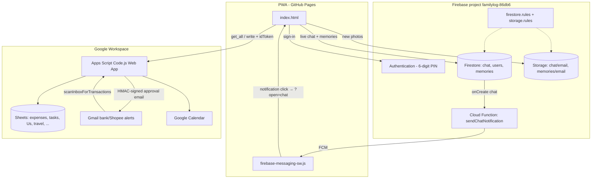

# Wong Family Log

Private family hub as a **Progressive Web App (PWA)**: budgets & expenses, Gmail bank/Shopee auto-capture, calendar & tasks, travel map, live family chat, and a couple-only “Us” space.

**Live (typical):** `https://marcuswongjw.github.io/familylog/`

---

## Features

### Finances
- Monthly **budgets** by category and account (Family / Personal)
- Expense ledger with filters, search, and charts
- Manual expense entry
- **Gmail scanner** → pending expenses → signed email approval → ledger
  - DBS PayLah!, DBS iBanking / PayNow, Trust Bank, **Shopee** (multi-item + order total)

### Family ops
- Google Calendar-backed **events**
- Tasks, birthdays, kid schedules
- **Travel map** (Leaflet)
- **Memories** (Firestore + Storage photos)

### Chat
- Real-time **Firestore** chat + image uploads to **Firebase Storage**
- Push notifications via **FCM** (tap opens Chat)
- *Not* stored in Google Sheets (you can delete any leftover **Chat** sheet)

### Us (parents only)
- Appreciation jar (Friday reveal), battery check-ins, spark roulette, bucket list
- Hidden in the UI for kids; **server also withholds** Us / fertility / bucket data

---

## Architecture



| Layer | Role |
|--------|------|
| **PWA** (`index.html`, `manifest.json`, `firebase-messaging-sw.js`) | UI, auth, chat, memories, calls GAS for sheet-backed data |
| **Firebase Auth** | Family logins (email + **6-digit PIN**) |
| **Firestore** | `chat`, `users` (FCM tokens), `memories` |
| **Storage** | New images at `chat/{email}/…` and `memories/{email}/…` |
| **Cloud Function** (`index.js`) | Push on new chat message; prune bad FCM tokens |
| **Apps Script** (`Code.js`) | Token-verified API, Gmail expense scanner, digests, calendar, Us data in Sheets |
| **Sheets** | Expenses, pending approvals, budgets, todos, travel, appreciations, love check-ins, fertility, log, etc. **No Chat tab** |

### Security model (summary)

- GAS: Firebase ID token **required** + **email allowlist** (not “any Firebase user”).
- Display name on writes comes from **verified email**, not the client.
- Us / fertility / bucket: **adult emails only** (server + UI).
- Expense approval links: **HMAC + expiry**; amount/date locked to pending row.
- Firestore/Storage rules: only the four family emails; chat delete = **own messages only**.

Details: [FIREBASE_SETUP.md](FIREBASE_SETUP.md).

---

## Repository layout

| Path | Purpose |
|------|---------|
| `index.html` | Entire PWA (UI + client logic) |
| `Code.js` | Google Apps Script backend (paste into the sheet’s script project) |
| `index.js` | Cloud Function `sendChatNotification` |
| `firebase-messaging-sw.js` | Service worker: cache, FCM background, notification click |
| `firestore.rules` / `storage.rules` | Security rules |
| `firebase.json` / `.firebaserc` | Firebase deploy config |
| `manifest.json` | PWA manifest |
| `FIREBASE_SETUP.md` | Auth, PIN policy, deploy commands |

---

## Setup

### 1. Google Sheet + Apps Script

1. Create a Google Sheet (tabs are created on demand; no **Chat** sheet needed).
2. **Extensions → Apps Script** → paste entire [Code.js](Code.js).
3. **Deploy → New deployment → Web app**
   - Execute as: **Me**
   - Who has access: **Anyone** (auth is still enforced via Firebase token + allowlist)
4. Copy the `/exec` URL into `index.html` as `GAS_URL`.
5. **Project Settings → Script properties** (recommended):
   - `APPROVAL_SECRET` — long random string (expense approval signatures)
   - Optional: `ALLOWED_EMAILS`, `ADULT_EMAILS`, `CALENDAR_ID`, `NOTIFY_EMAILS`, `WEB_APP_URL`
6. **Triggers:** e.g. `scanInboxForTransactions` every 10–15 minutes; optional daily digests.

### 2. Firebase

1. Project with **Auth (Email/Password)**, **Firestore**, **Storage**, **Cloud Messaging**, **Functions**.
2. Create one Auth user per family member (email = `MEMBERS` in `index.html`, password = **6-digit PIN**).
3. Put web config + VAPID key in `index.html` / `firebase-messaging-sw.js`.
4. Deploy rules and function (from repo root, logged into Firebase CLI):

```bash
npm install
firebase use familylog-86db6   # or your project id
firebase deploy --only firestore:rules,storage,functions
```

See [FIREBASE_SETUP.md](FIREBASE_SETUP.md) for step-by-step Auth setup.

### 3. GitHub Pages

1. Push `main` to GitHub.
2. **Settings → Pages →** deploy from `main` (root).
3. Open the site → **Add to Home Screen** for PWA + notifications (iOS 16.4+ home-screen install required for web push).

After deploys, hard-refresh or re-open the PWA so `firebase-messaging-sw.js` cache updates (versioned as `wong-family-v*`).

---

## Day-to-day operations

| Task | Where |
|------|--------|
| Change UI / client | Edit `index.html` → push → Pages |
| Change expense parsers / GAS API | Edit `Code.js` → paste into Apps Script → **New deployment version** |
| Change push / rules | Edit `index.js` / `*.rules` → `firebase deploy --only …` |
| Approve bank/Shopee pending | Email link or process pending sheet |
| Kids vs parents | Adults: Marcus & Eleanor emails; kids UI hides Us + Fertility |

---

## Expense scanner notes

- Supported sources: PayLah, DBS iBanking, Trust, Shopee, plus optional Gmail labels `expense` / `expenses`.
- **Shopee:** amount = **order total paid**; description lists **all** line items (not only the first product).
- Duplicates checked via amount/date/merchant and **transaction / order ref**.
- Failed parses: `Expense-Failed` label; processed: starred + archived + `Expense-Processed`.

---

## Privacy

This is a **private family** app. The GitHub repo may be public (static assets + client config). Do not put secrets in the client beyond normal Firebase web config. Keep Firestore/Storage rules and GAS allowlists tight. Prefer **Firebase Storage** for new photos (not public Drive links).

---

## License / use

Personal family project. Fork and adapt for your household if useful; update emails, Firebase project, `GAS_URL`, and rules allowlists before deploying.
