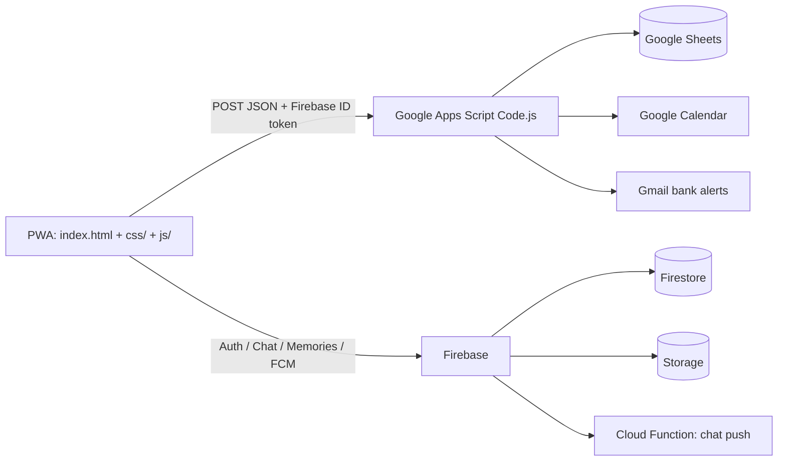

# 🏡 Wong Family Log

A private family hub PWA: budgets & expenses, calendar/tasks, travel map, chat, memories, and a parents-only **Us** sanctuary.

**Live app:** [GitHub Pages](https://marcuswongjw.github.io/familylog/)  
**Repo:** [marcuswongjw/familylog](https://github.com/marcuswongjw/familylog)

---

## Architecture



| Layer | Tech | Role |
|--------|------|------|
| **Frontend** | `index.html`, `css/styles.css`, `js/app.js` | UI, Firebase Auth login (6-digit PIN), Firestore chat/memories |
| **API** | `Code.js` (Apps Script web app) | Expenses, budgets, calendar, todos, fertility, Us data — **family allowlist + token verify** |
| **Realtime** | Firestore + Storage | Chat messages, memory images, FCM tokens |
| **Push** | `index.js` Cloud Function + `firebase-messaging-sw.js` | Chat notifications |
| **Hosting** | GitHub Pages | Static frontend |

---

## Features

### Family
- **Home dashboard** — summary, today events/tasks, member overview  
- **Chat** — Firestore realtime (with optional images) + FCM push  
- **Calendar / Tasks / Schedules** — Google Calendar + Sheets todos  
- **Expenses & budgets** — ledger, categories, gauges; Gmail bank-alert scanner  
- **Travel map** — Leaflet pins by trip  
- **Memories** — photos + notes (Firestore + Storage)  
- **Birthdays / recurring expenses**

### Parents only (Us + Fertility)
- **Us sanctuary** — battery check-ins, appreciation jar (Friday reveal), bucket list, spark roulette  
- **Intimacy log** — private log when you make love (date, notes, optional 1–5 hearts); adults only  
- **Fertility tracker** — period / ovulation / symptoms; adaptive cycle estimates  

Kids’ accounts cannot open Us/Fertility (UI + server empty payloads / write deny).

---

## Project layout

```
index.html              # Shell markup + third-party CDN scripts
css/styles.css          # All app styles
js/app.js               # Client logic (auth, GAS client, screens)
Code.js                 # Google Apps Script backend (deploy separately)
firebase-messaging-sw.js
index.js                # Cloud Function (chat → FCM)
firestore.rules
storage.rules
manifest.json
```

After editing frontend files, commit and push to `main` for GitHub Pages.  
After editing `Code.js`, **Deploy → Manage deployments → New version** in Apps Script.

---

## Security model

1. **Firebase Auth** — each member has an account (email + 6-digit PIN password).  
2. **GAS API** — every `POST` must include a Firebase `idToken`; server verifies via Identity Toolkit and checks **ALLOWED_EMAILS**.  
3. **Identity** — write actions use email→name mapping server-side; client `user` field is not trusted.  
4. **Adult-only notes** — `add_intimacy`, Us, fertility, bucket list enforced in `ADULT_ONLY_NOTES`.  
5. **Firestore / Storage rules** — family email allowlist; uploads under `chat/{email}/` and `memories/{email}/`.  
6. **Expense approval emails** — signed links (`id` + `exp` + HMAC); set Script Property `APPROVAL_SECRET` to a long random string.

---

## Setup (short)

### Firebase
See [FIREBASE_SETUP.md](FIREBASE_SETUP.md) for Auth, family users, FCM, and rules deploy.

### Apps Script
1. Bind `Code.js` to the family spreadsheet.  
2. Deploy as **Web App** (Execute as: Me, Access: Anyone).  
3. Paste the web app URL into `js/app.js` as `GAS_URL`.  
4. Triggers: inbox scanner, `dailyNotifications`, `keepAlive` as needed.  
5. Script properties (optional but recommended): `APPROVAL_SECRET`, `CALENDAR_ID`, `NOTIFY_EMAILS`, etc.

### GitHub Pages
Settings → Pages → branch `main` / root.  
App URL: `https://marcuswongjw.github.io/familylog/`

### Phone PWA
Open the site → **Add to Home Screen**.  
Updates: open the app **online** after a deploy (no App Store reinstall). Redeploy **GAS** separately when `Code.js` changes.

---

## API (client → GAS)

All app traffic uses **HTTP POST** with JSON body (no ID token in query strings):

```json
{ "action": "get_all", "idToken": "…" }
{ "action": "write", "note": "add_expense", "idToken": "…", … }
```

Email approval pages still use **GET** with signed `id` / `exp` / `sig` (no Firebase session).

---

## Pull to refresh

On the main app screens, **pull down** from the top of the scroll area (when already at scroll top) to reload dashboard data from GAS. The header 🔄 button still works too.

---

## Privacy note (Us / intimacy)

Intimacy log and fertility data are:
- Only returned for **adult** accounts in `get_all`  
- Only writable by adults  
- Stored in Google Sheets tabs `IntimacyLog` / `Fertility` (same Google account as the spreadsheet)

Treat the spreadsheet ACL carefully (share only with parents if preferred).
