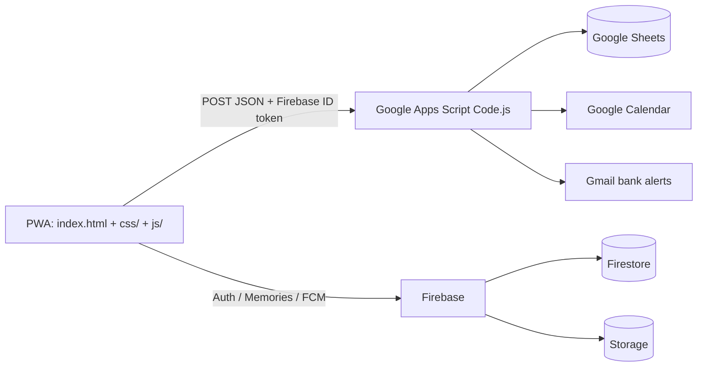

# Wong’s Nest

A personal family hub PWA: school + daily/weekly logistics, budgets & expenses, calendar/tasks, travel map, memories, and a parents-only **Us** sanctuary.

**Live app:** [GitHub Pages](https://marcuswongjw.github.io/familylog/)  
**Repo:** [marcuswongjw/familylog](https://github.com/marcuswongjw/familylog)

---

## Architecture

**Full ownership rules:** [ARCHITECTURE.md](ARCHITECTURE.md) (Sheets vs Firebase — what lives where and why).


```mermaid
flowchart LR
  PWA[PWA: index.html + css/ + js/] -->|POST JSON + Firebase ID token| GAS[Google Apps Script Code.js]
  GAS --> Sheets[(Google Sheets)]
  GAS --> GCal[Google Calendar]
  GAS --> Gmail[Gmail bank alerts]
  PWA -->|Auth / Memories / FCM| FB[Firebase]
  FB --> FS[(Firestore)]
  FB --> ST[(Storage)]
```

| Layer | Tech | Role |
|--------|------|------|
| **Frontend** | `index.html`, `css/styles.css`, `js/app.js` | UI; routes each feature to the correct backend |
| **Firebase** | Auth, Firestore, Storage, FCM | **Owns:** login, memories, photos, push tokens |
| **GAS + Sheets** | `Code.js` + spreadsheet | **Owns:** money, tasks, calendar, travel, Us/fertility logs; Gmail bank scan |
| **Functions** | `index.js` | School announcement extraction |
| **Hosting** | GitHub Pages | Static frontend |

**Do not dual-write.** Memories never go through Sheets. Expenses and Us data never go through Firestore. Kids never receive money payloads.

---

## Features

### Family
- **Home dashboard** — school copilot, today/tomorrow logistics, member overview  
- **Calendar / Tasks / Schedules** — Google Calendar + Sheets todos (week view first)  
- **Expenses & budgets** — ledger, categories, gauges; Gmail bank-alert scanner (parents only)  
- **Travel map** — Leaflet pins by trip  
- **Memories** — photos + notes (Firestore + Storage)  
- **Birthdays / recurring expenses**

### Parents only (Us + Fertility)
- **Us sanctuary** — battery check-ins, appreciation jar (Friday reveal), bucket list, spark roulette  
- **Intimacy log** — private log when you make love (date, notes, optional 1–5 hearts); adults only  
- **Fertility tracker** — period / ovulation / symptoms; adaptive cycle estimates  

Kids’ accounts cannot open Us/Fertility (UI + server empty payloads / write deny).

---

## Project layout

```
ARCHITECTURE.md         # Sheets vs Firebase ownership (read this first)
index.html              # Shell markup + third-party CDN scripts
css/styles.css          # All app styles
js/app.js               # Client: Firebase memories/auth + GAS for Sheets data
Code.js                 # Apps Script: Sheets/Calendar/Gmail only (deploy separately)
firebase-messaging-sw.js
index.js                # Cloud Functions (school extraction)
firestore.rules
storage.rules
manifest.json
FIREBASE_SETUP.md
```

After editing frontend files, commit and push to `main` for GitHub Pages.  
After editing `Code.js`, run `./scripts/deploy-gas.sh` (clasp push + existing web app deployment). One-time setup: `npx @google/clasp@2.5.0 login` and a `.clasp.json` with the Apps Script project ID.

---

## Security model

1. **Firebase Auth** — each member has an account (email + 6-digit PIN password).  
2. **GAS API** — every `POST` must include a Firebase `idToken`; server verifies via Identity Toolkit and checks **ALLOWED_EMAILS**.  
3. **Identity** — write actions use email→name mapping server-side; client `user` field is not trusted.  
4. **Adult-only notes** — `add_intimacy`, Us, fertility, bucket list enforced in `ADULT_ONLY_NOTES`.  
5. **Firestore / Storage rules** — family email allowlist; uploads under `memories/{email}/`.  
6. **Expense approval emails** — signed links (`id` + `exp` + HMAC); set Script Property `APPROVAL_SECRET` to a long random string.

---

## Setup (short)

### Firebase
See [FIREBASE_SETUP.md](FIREBASE_SETUP.md) for Auth, family users, FCM, and rules deploy.

### Apps Script
1. Bind `Code.js` to the family spreadsheet.  
2. Deploy as **Web App** (Execute as: Me, Access: Anyone).  
3. Paste the web app URL into `js/app.js` as `GAS_URL`.  
4. Triggers: inbox scanner, `dailyNotifications`, `keepAlive` as needed.  
5. Script properties (optional but recommended): `APPROVAL_SECRET`, `CALENDAR_ID`, `NOTIFY_EMAILS`, etc.

### GitHub Pages
Settings → Pages → branch `main` / root.  
App URL: `https://marcuswongjw.github.io/familylog/`

### Phone PWA
Open the site → **Add to Home Screen**.  
Updates: open the app **online** after a deploy (no App Store reinstall). Redeploy **GAS** separately when `Code.js` changes.

---

## API (client → GAS)

All app traffic uses **HTTP POST** with JSON body (no ID token in query strings):

```json
{ "action": "get_all", "idToken": "…" }
{ "action": "write", "note": "add_expense", "idToken": "…", … }
```

Email approval pages still use **GET** with signed `id` / `exp` / `sig` (no Firebase session).

---

## Pull to refresh

On the main app screens, **pull down** from the top of the scroll area (when already at scroll top) to reload dashboard data from GAS. The header 🔄 button still works too.

---

## Privacy note (Us / intimacy)

Intimacy log and fertility data are:
- Only returned for **adult** accounts in `get_all`  
- Only writable by adults  
- Stored in Google Sheets tabs `IntimacyLog` / `Fertility` (same Google account as the spreadsheet)

Treat the spreadsheet ACL carefully (share only with parents if preferred).

## Companions & stars

Home now includes an original animal companion and a shared family garden. Open **Nest → Companions & stars** to choose a fox, rabbit, bear or cat, name it, and spend earned stars on accessories. Parents use **Choose what earns stars** to select an existing task or habit and set 0, 1, 3 or 5 stars. Activities start with no rewards until a parent selects them.

Tasks reward the assignee once; an Everyone task rewards its first completer. Habits reward once per member per Singapore calendar day, after the save succeeds. Older entries earn no stars. Removing an entry keeps earned stars, and logging it again cannot earn more. Spending stars keeps lifetime family progress toward the 40-star garden. Animations are brief and respect reduced-motion settings.

Deploy the updated `Code.js` web app **before** publishing the frontend. `RewardRules`, `RewardLedger` and `Companions` sheets are created automatically on their first write; the ToDo sheet gains a `Reward Member` column for reliable completion retries. No Firebase rules or functions change is needed. A frontend connected to the old backend shows an update message on the companions screen.

Validation: `npm test`. For an isolated browser preview, run `node tests/preview-server.cjs --rewards-demo` and open `http://127.0.0.1:4173`. The preview uses the real frontend and Apps Script handlers with in-memory Sheets and mocked external services; it never writes production family data.

## Wong’s Nest redesign

The app now uses a nest emblem, lavender/apricot paper surfaces, Nunito headings and DM Sans body text. Desktop has a permanent sidebar; phones have Home, Plan, Tasks, Nest and More. More includes every additional family destination and the adult-only parent tools. Login, page headings, cards, forms, dark mode, companions, app icons, notification defaults and email digest names share the new identity.

`css/nest.css` is the current design layer, and `js/nest.js` owns icons, headings and navigation presentation. See `BRAND.md`. Existing family accounts, backend addresses, stored preferences, permissions and reward rules are retained. Publish the Apps Script changes before the frontend. The new PWA cache version refreshes the app shell; operating systems may refresh an already installed home-screen icon separately.
